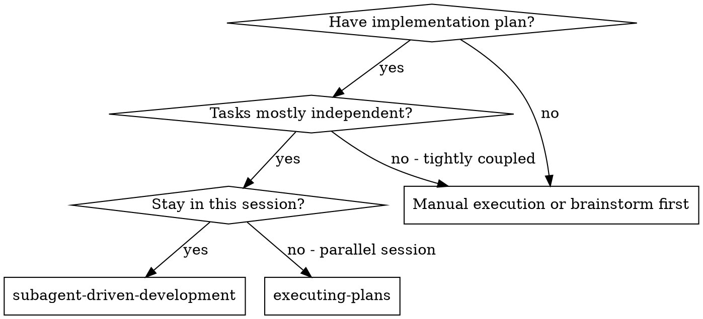
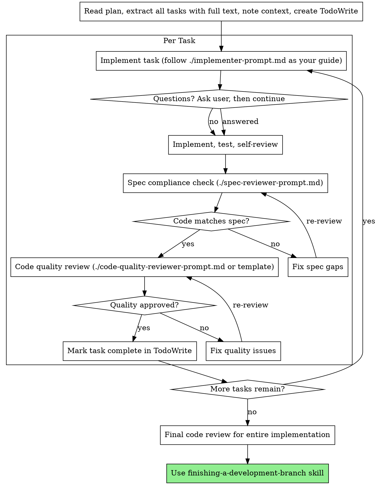

# Subagent-Driven Development (Task-by-Task with Two-Stage Review)

Execute a plan task-by-task in the current Cursor session. For each task: implement it, then run a spec-compliance check (did you build what was requested?), then run a code-quality review. Use TodoWrite to track tasks.

**Core principle:** One task at a time + two-stage review (spec then quality) = high quality, fast iteration

## When to Use



**vs. Executing Plans (separate session):**
- Same Cursor session (no handoff)
- One task at a time (clear focus)
- Two-stage review after each task: spec compliance first, then code quality
- Faster iteration (no human-in-loop between tasks)

## The Process



## Prompt Templates (Use as Your Own Checklist)

- `./implementer-prompt.md` — Follow this when implementing each task (questions, implement, test, self-review)
- `./spec-reviewer-prompt.md` — Use to check your implementation against the spec (read code, compare to requirements)
- `./code-quality-reviewer-prompt.md` — Use the code-reviewer template for a quality pass (or request human review)

## Example Workflow

```
You: I'm using Subagent-Driven Development to execute this plan.

[Read plan file once: docs/plans/feature-plan.md]
[Extract all 5 tasks with full text and context]
[Create TodoWrite with all tasks]

Task 1: Hook installation script

[Get Task 1 text and context (already extracted)]
[You implement following implementer-prompt.md: ask if unclear, then implement, test, self-review]

You (if needed): "Before I begin — should the hook be installed at user or system level?"
User: "User level (~/.config/.../hooks/)"

You: Implement install-hook command, add tests (5/5 passing), self-review (e.g. add --force if missed). Save work.

[You run spec compliance check using spec-reviewer-prompt.md]
Result: ✅ Spec compliant — all requirements met, nothing extra

[You run code quality review using code-reviewer template or request human review]
Result: Strengths: Good test coverage, clean. Issues: None. Approved.

[Mark Task 1 complete in TodoWrite]

Task 2: Recovery modes

[Get Task 2 text and context (already extracted)]
[You implement: verify/repair modes, 8/8 tests passing, self-review, save work]

[You run spec compliance check]
Result: ❌ Issues:
  - Missing: Progress reporting (spec says "report every 100 items")
  - Extra: Added --json flag (not requested)

[You fix: remove --json, add progress reporting]

[Spec check again]
Result: ✅ Spec compliant now

[You run code quality review]
Result: Strengths: Solid. Issues (Important): Magic number (100)

[You fix: extract PROGRESS_INTERVAL constant]

[Code quality review again]
Result: ✅ Approved

[Mark Task 2 complete]

...

[After all tasks]
[Dispatch final code-reviewer]
Final reviewer: All requirements met, ready to merge

Done!
```

## Advantages

**vs. Ad-hoc execution:**
- You follow TDD and the implementer checklist per task
- One task at a time (clear focus, less confusion)
- Two-stage review catches spec and quality issues before moving on

**vs. Executing Plans (separate session):**
- Same Cursor session (no handoff)
- Continuous progress (no waiting)
- Review checkpoints built in

**Efficiency:**
- Extract all tasks from the plan once; use full text per task
- Spec and quality checks prevent rework later

**Quality gates:**
- Self-review catches issues before review
- Two-stage review: spec compliance, then code quality
- Review loops ensure fixes actually work
- Spec compliance prevents over/under-building
- Code quality ensures implementation is well-built

## Red Flags

**Never:**
- Start implementation on main branch without explicit user consent
- Skip reviews (spec compliance OR code quality)
- Proceed with unfixed issues
- Work on multiple tasks in parallel (one at a time)
- Skip providing full task text and context (you need it; don't make "subagent" read the plan file)
- Accept "close enough" on spec compliance (issues found = not done)
- Skip review loops (fix issues, then re-review until approved)
- Use only self-review (both spec check and code quality check are required)
- **Start code quality review before spec compliance is ✅** (wrong order)
- Move to next task while either review has open issues

**If you have questions before implementing:**
- Ask the user clearly; get context
- Don't guess — clarify then proceed

**If spec or quality review finds issues:**
- Fix them, then run the relevant review again
- Repeat until approved
- Don't skip the re-review

## Integration

**Related skills:**
- **using-git-worktrees** — Optional: suggest isolated workspace before starting if user wants it
- **writing-plans** — Creates the plan this skill executes
- **requesting-code-review** — Code review template for the quality-review step
- **finishing-a-development-branch** — Complete development after all tasks
- **test-driven-development** — Follow TDD for each task

**Alternative workflow:**
- **executing-plans** — Use for a separate session with batched execution and human checkpoints
